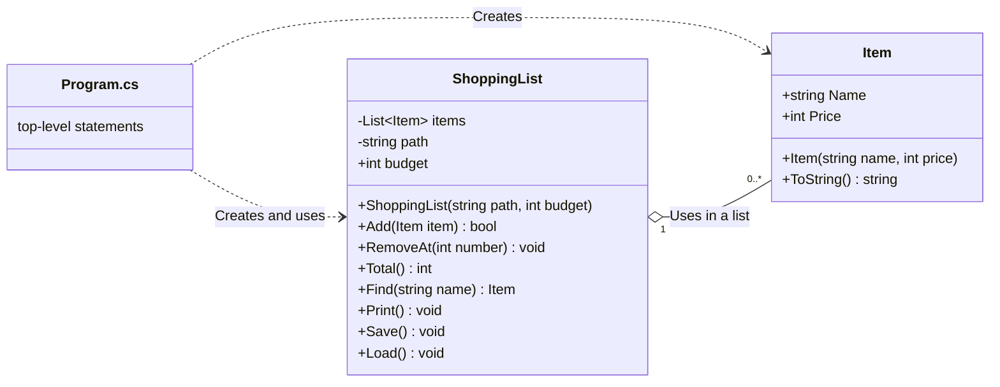

# Shopping list

## Bugs & fixes

1. `ShoppingList.Load()` -> `string text = File.ReadAllText(path)`

    This threw a *FileNotFoundException* when I ran the code with the debugger, because the debugger used './bin/debug/net10.0' as working directory and therefore couldn't find 'items.txt'.

    I added a *try*/*catch*, because we can't guarantee that the file exists. If the file doesn't exist, it's created in the *catch* block.

    I also asked Claude to change the working directory for the debugger from '.\bin\Debug\net10.0' to '.' and he added 'Properties\launchSettings.json', that sets "workingDirectory" to "$(ProjectDir)", so 'items.txt' can be reached when using the debugger.

    Commit hash: 42f5b2011febb011bb337795d116922b056b64d0

2. `ShoppingList.Load()` - `items.Add(new Item(parts[1], int.Parse(parts[0])));`

    This threw an *IndexOutOfRangeException* on the last row of 'items.txt', because the newline at the end of 'items.txt' is basically an empty line. The empty line becomes an array containing 1 empty string returned from `line.Split(';');`

    The solution is to check that there are 2 parts of the array before adding them to the new Item.

    Commit hash: e93a3d05fc12466d4f8b953768b1511f1c0b4c02

3. `ShoppingList.Load()` - `items.Add(new Item(parts[1], int.Parse(parts[0])));`

    If the price is wrong in 'items.txt', this throws a *FormatException*.

    I added `int.TryParse(parts[0], out price)` to avoid adding an item with an invalid price.

    *This may not be part of the exercise and may never happen as long as 'items.txt' isn't modified outside our application, but in a real application, I'd handle it anyway, perhaps with an error message and a log instead of silence.*

    Commit hash: e93a3d05fc12466d4f8b953768b1511f1c0b4c02

4. `ShoppingList.Load()/Save()` - Item number and `Item.Name` don't appear on screen after `ShoppingList.Print()`

    This happened because 'items.txt' is saved with "\r\n" as line breaks and loaded with only "\n". That means that `Item.Name` ends with '\r', which moves the cursor to the beginning of the line, so the text that was already written is overwritten by `Item.Price`.

    I chose to use Environment.NewLine for line breaks, to follow the operating system standard and to make sure it's the same when saving and loading the file.

    Commit hash: 653db0b65694df2955b226c7bff35f2eb5b5ff45

5. `ShoppingList.Save()` - `File.WriteAllText()`, Empty catch
    Since I would have to cheat and remove or change the access rights to the working directory while the application is running to trigger an exception for `File.WriteAllText()`, I didn't bother to trigger it.

    Because I'm not allowed to use *Exception*, which I probably would in a real application, since it's `Exception.Message` I'd be interested in in this case, I instead asked Claude for the most common exceptions from the call. Therefore I added *IOException* and *UnauthorizedAccessException*.

    Commit hash: ba36c810d715e0713a6536c36f0836f90285934f

6. Program.cs (Menu) - `int choice = int.Parse(Console.ReadLine());`

    If the user enters anything other than an integer, it throws a *FormatException*.

    Using `int.TryParse()` instead of `int.Parse()` to avoid crashing when the user inputs something other than an integer. When the user enters something invalid, *choice* is 0 which isn't a valid menu choice, so there's no need to check the return value of `int.TryParse()`.

    Commit hash: 5ed425b35c7701dbd5d91623165bcdcc6d5fce61

7. Program.cs (Add Item block) - `int price = int.Parse(Console.ReadLine());`

    If the user enters anything other than an integer, it throws a *FormatException*.

    Using `int.TryParse()` instead of `int.Parse()` to avoid crashing when the user inputs something other than an integer for the price. Using the return value from `int.TryParse()` to decide if the item should be added or the user needs to be informed of their mistake.

    Commit hash: f91c3d879f8a691d3a865e8444a1ce4eec37761e

8. Program.cs (Add Item block) - `string name = Console.ReadLine();`

    If the user enters nothing or whitespace, the name of the item would be empty, and that's not acceptable.

    I trimmed away all whitespace and added a check that name isn't empty before adding the item. If name is empty, the user is informed.

    Commit hash: f91c3d879f8a691d3a865e8444a1ce4eec37761e

9. Program.cs (Remove Item block) - `int number = int.Parse(Console.ReadLine());`

    If the user enters anything other than an integer, it throws a *FormatException*.

    Using `int.TryParse()` to avoid crashing when the user enters an invalid number. If the function returns false, the user is informed.

    Commit hash: a485e8fd3881f3b04e70f355309b747a536c0fe4

10. Program.cs (Remove Item block) - `list.RemoveAt(number);`

    Throws an *ArgumentOutOfRangeException* exception when the user tries to remove an item that isn't in the list.

    Added a *try*/*catch* block to inform the user of their mistake rather than crashing the application.

    Commit hash: a485e8fd3881f3b04e70f355309b747a536c0fe4

11. `ShoppingList.Total()` - The total sum wasn't calculated correctly.

    The for-loop that adds all the prices started at index 1, which misses the first item, since lists and arrays use a 0-based index in C#.

    Starting the for-loop at 0 instead of 1.

    Commit hash: 8e81ecd98425a16a7ddccd48efb4ec9117b3d3b3

---

## Extending functionality

### Item makes sure it has a name and a valid price

The Item constructor throws an *ArgumentException* if name is empty after all whitespace has been trimmed from the beginning and end of the string. It also throws an *ArgumentOutOfRangeException* if the price is negative.

The setters for Name and Price have been removed, so it's not possible to set faulty values after the Item has been created.

Program.cs catches both exceptions. It has to catch *ArgumentOutOfRangeException* first, because it inherits *ArgumentException*. If the compiler allowed *ArgumentException* to be caught first, it would catch both.

Commit hash: 3dcecca4ec5246ca473497ba872b05f97637a254

### Budget

Added Budget to `ShoppingList`.

`ShoppingList.Add()` returns true when a new item is added and false if it's not added because it would break the budget.

I chose to go with returning a boolean to handle the budget control, because it's simple and logical. The addition of the item failed, therefore it returned false. It's easy to handle in Program.cs, there's no need to catch an exception.

Commit hash: 3549f54836d4d7cc06490038396ba9398204c74b

## Extra functionality (not mandatory)

### Save the budget

Saves the budget in items.txt, together with the shopping list. The name and amount is reversed, so it won't be mistaken for an item in case it's not supported when the file is loaded.

Commit hash: a92630245d1787f4491c9ec0b94e3f383598e58e

### BudgetTooLowException

*BudgetTooLowException* is thrown when the budget is lower than 50kr.

Commit hash: 10557d6486905a4e758a5bdb8276ef4352a60896

### using

I had to change how `ShoppingList.Save()` and `ShoppingList.Load()` writes and reads items.txt to make *using* useful. `ShoppingList.Save()` now use a *StreamWriter* and `ShoppingList.Load()` use a *StreamReader*.

Commit hash: efc26409cb7b77eb2dd96f2820cb4b2532da8c0a

## My own ideas

### Autosave the shopping list

Save the list automatically when exiting the program. This way you won't make a bunch of changes and lose them because you forgot to save the list.

Commit hash: b0540492a3a729f2a5ac53ed4aff89c915c94307

---

## Class diagram

Commit hash: 6c27862bd3e5ffcaf1770c5aa403973dc51f13ad

