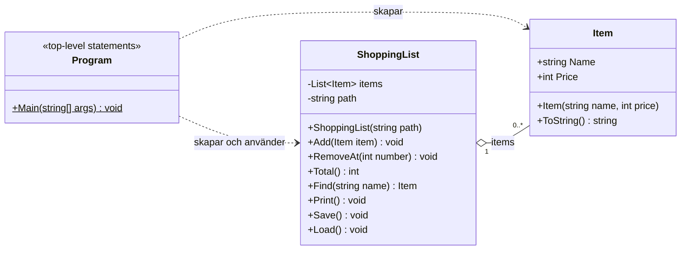

# Klassdiagram

## Förklaring

- **Program** – Programmets startpunkt (top-level statements i `Program.cs`). Visar menyn, läser in användarens val och anropar metoder på `ShoppingList`. Skapar nya `Item`-objekt när användaren lägger till en vara.
- **ShoppingList** – Håller en lista med varor och sköter inläsning från och sparande till filen (`items.txt`).
- **Item** – En vara på inköpslistan med namn och pris.

### Relationer

| Relation | Typ | Beskrivning |
|---|---|---|
| `Program` → `ShoppingList` | Beroende | `Program` skapar en `ShoppingList` och anropar dess metoder. |
| `Program` → `Item` | Beroende | `Program` skapar nya `Item` vid "Lägg till vara" och tar emot `Item` från `Find()`. |
| `ShoppingList` ◇— `Item` | Aggregation (1 till 0..*) | En `ShoppingList` innehåller noll eller flera `Item`. |

### Symboler

- `+` public, `-` private
- `$` statisk metod
